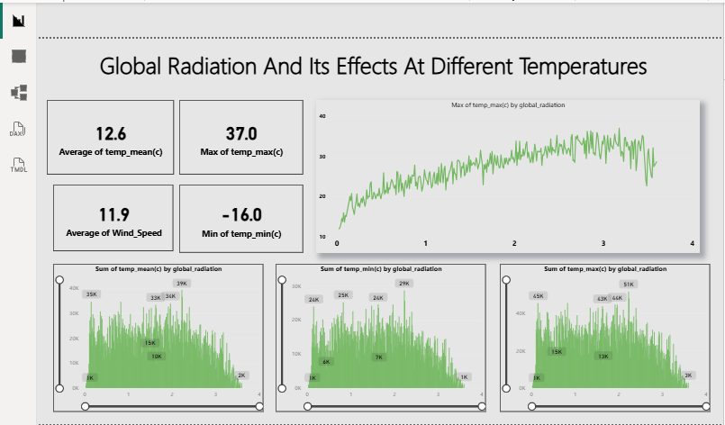

# Global-Radiation-Analysis
☀️ تحليل الإشعاع العالمي وتأثيره الحراري | Global Radiation &amp; Temperature Analysis مشروع تحليل بيانات (Data Analytics) يهدف إلى دراسة العلاقة بين الإشعاع العالمي (Global Radiation) وتغيرات درجات الحرارة وسرعة الرياح، معتمداً على تمثيل بصري متقدم لاتخاذ رؤى علمية دقيقة.
📝 وصف المشروع (Project Overview)
يركز هذا المشروع على فهم كيف يؤثر مستوى الإشعاع على المناخ، من خلال مراقبة القيم القصوى والدنيا لدرجات الحرارة وربطها بمستويات الإشعاع المسجلة. اللوحة مصممة باستخدام Power BI لتقديم تحليل إحصائي عميق.
🛠️ الميزات والتحليلات (Key Features)
مؤشرات الأداء الرئيسية (KPIs):
متوسط درجة الحرارة (12.6°C).
أقصى درجة حرارة مسجلة (37.0°C).
أقل درجة حرارة مسجلة (-16.0°C).
متوسط سرعة الرياح (11.9).
تحليل الارتباط (Correlation): مخطط خطي يوضح العلاقة الطردية بين زيادة الإشعاع العالمي وارتفاع الحد الأقصى لدرجات الحرارة.
توزيع البيانات (Distribution): ثلاثة مخططات مساحية (Area Charts) تعرض مجموع درجات الحرارة (المتوسطة، الصغرى، والعظمى) مقابل مستويات الإشعاع، مما يساعد في فهم كثافة البيانات عند مستويات إشعاع معينة.
🧰 الأدوات والتقنيات (Tools & Skills)
الأداة الأساسية: Power BI Desktop.
لغات التحليل: استخدام DAX لعمليات الحساب الإحصائية (Measures) و TMDL لوصف موديل البيانات.
معالجة البيانات: تنظيف البيانات وربط المتغيرات المناخية ببعضها لضمان دقة النتائج.
📈 أهم الاستنتاجات (Insights)
يوجد تأثير مباشر وواضح لزيادة الإشعاع العالمي على رفع درجات الحرارة العظمى.
تباين كبير في درجات الحرارة (من -16 إلى 37) مما يشير إلى تحليل بيانات تغطي مواسم أو مناطق جغرافية مختلفة.
p align="center">  

